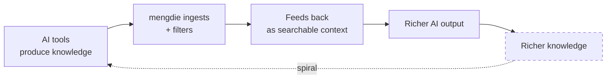
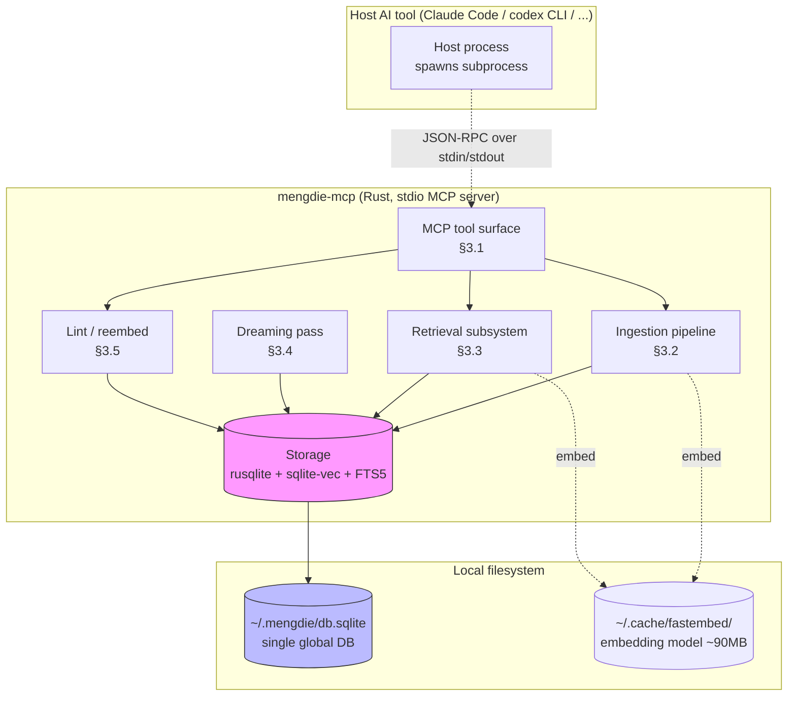
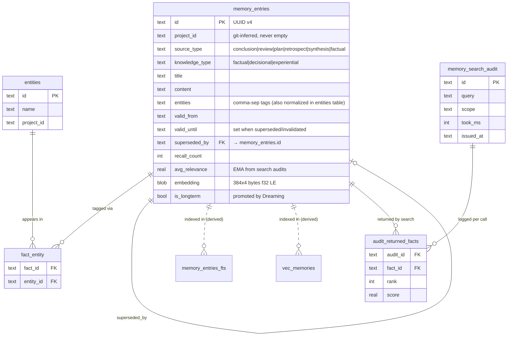
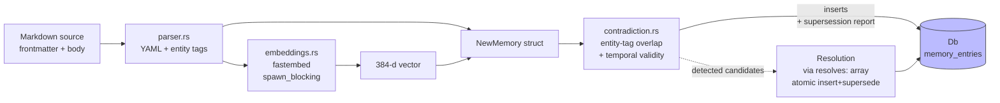
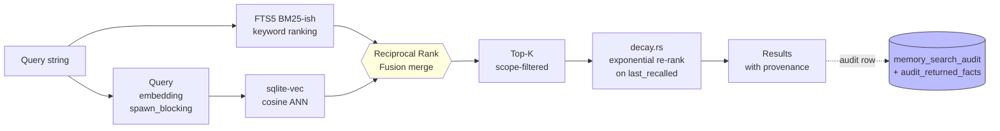
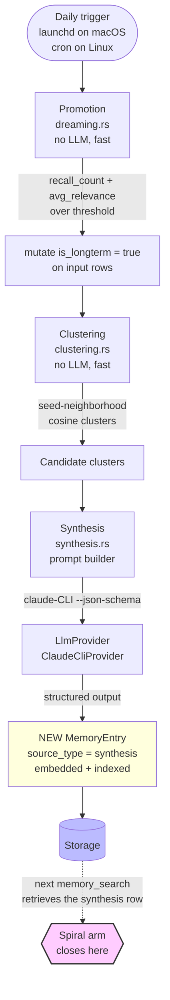

# Mengdie — Technical Design

**Status**: living document
**Last updated**: 2026-05-23

System-level design for mengdie. For installation and usage, see [README](../README.md). For per-release deltas, see [CHANGELOG](../CHANGELOG.md). For contributor conventions (Rust style, testing, commit hygiene), see [CLAUDE.md](../CLAUDE.md).

---

## 1. Vision

### 1.1 The problem

AI-assisted development sessions produce a lot of knowledge — design decisions, code reviews, plans, retrospects, post-mortems. Without persistent memory across sessions:

- Every new session re-discovers prior context. Research workflows re-read the same files. Multi-agent discussions repeat positions already settled.
- LLM context windows force a false binary: dump everything (signal-to-noise collapse) or dump nothing (start cold every time).
- Decisions reverse silently because the prior decision wasn't visible at decision time.

The cost is paid in tokens, in time, and in trust — a system that "forgot" its prior reasoning erodes the operator's confidence in handing it real work.

### 1.2 The approach

Mengdie is a persistent memory layer for AI-assisted development. It stores structured artifacts produced by AI workflows, filters them through a daily promotion + synthesis pass, and serves them back as searchable context with explicit provenance.

The core loop is a spiral:



The spiral has two distinct arms:

- **Retrieval arm**: every search call retrieves prior facts with provenance (source file, knowledge type, validity timestamp). AI agents reason with grounded prior context instead of from scratch.
- **Synthesis arm**: a daily Dreaming pass clusters frequently-recalled memories and asks an LLM to consolidate each cluster into a new `synthesis` row. Synthesis rows are themselves indexed + searchable — the loop literally creates new knowledge from old.

> Mengdie (梦蝶) is named after Zhuangzi's butterfly dream (庄周梦蝶). AI produces knowledge, knowledge feeds AI — who is the dreamer?

### 1.3 Who it's for

**Primary user**: a single-operator AI-assisted developer running mengdie alongside one or more host AI tools (Claude Code, codex CLI, gemini, etc.).

**Primary integration**: the [Agentic Engineering plugin](https://github.com/xmkevinchen/agentic-engineering) ("AE"). AE provides in-session LLM workflow orchestration; mengdie provides the persistent cross-session memory layer that AE workflows depend on.

**Not for**: multi-tenant SaaS, generic full-text search, real-time event streaming, public-facing knowledge bases.

### 1.4 Design principles

8 invariants. Reasoning that violates one of these is usually a sign to redesign.

1. **MCP server, not plugin.** Zero dependency on any specific host AI tool. `mengdie-mcp` is a stdio MCP server registered in the host's MCP config.
2. **Structured-artifact ingestion is primary.** Mengdie ingests markdown artifacts produced by upstream AI pipelines (conclusion / review / plan / retrospect / synthesis). These have already been filtered by upstream review — high signal-to-noise.
3. **Post-research injection.** AI agents research independently first, then see prior memory as supplemental context. Never up-front injection (anchoring bias).
4. **Non-silent feedback.** Every injection block shows what was retrieved with provenance. No silent context smuggling.
5. **Global storage, per-project default scope.** One SQLite DB at `~/.mengdie/db.sqlite`; queries default to current project's scope; explicit opt-in for cross-project search.
6. **No AI judgment at cold start.** Existing notes are batch-imported without LLM filtering. Error amplification at the seeding step is the worst place to introduce it.
7. **Entity-tag + temporal validity.** Decisions have entity tags; contradictions are detected via directed entity-tag overlap; supersession is recorded with `valid_until` + `superseded_by`. Decision evolution is first-class.
8. **Agent-centric tech stack.** Code is written largely by AI agents — optimize for compiler guardrails (Rust strictest), single binary (no runtime install dance), sub-1s warm startup.

### 1.5 Out of scope

- **Multi-tenant access control** — single-operator is the v0.x scope. NOT permanently rejected; could be a v1.x+ effort. **Hard prerequisites** if pursued: (a) enforce `project_id` in SQL WHERE clause for ALL destructive operations (currently MCP-layer guard only; see §2.3 invariant I6); (b) per-row RBAC or per-tenant DB partitioning (single shared `db.sqlite` is not multi-tenant safe); (c) MCP server lifecycle rework (one process per tenant vs shared with tenant routing).
- **Generic vector database.** sqlite-vec is implementation detail; mengdie's value is the loop, not the storage layer.
- **Real-time streaming.** Consumers poll. No WebSocket or SSE.
- **Web UI or visualization.** `mengdie audit-stats` CLI + LLM-generated summaries are the inspection surface.
- **Plugin auto-install / marketplace integration.** Mengdie ships as a single binary; users install + register manually.

---

## 2. Architecture

### 2.1 System view



### 2.2 Process model

- `mengdie-mcp` is a long-running stdio MCP subprocess. The host AI tool spawns it once at session start and keeps the pipe open for the session.
- **One process per host installation**, not one per workspace. Mengdie is registered globally in the host's MCP config (e.g., `~/.claude/settings.json`'s `mcpServers` block) with no per-workspace `cwd` override.
- Consequence: the SAME `mengdie-mcp` process persists across the operator's workspace switches in a single host window. The `project_id` inferred from cwd at startup is the host's launch cwd — typically the first project opened, not the currently-active one. This is why every MCP tool accepts an optional caller-supplied `project_id` override (see §3.1).

`project_id` is resolved via a precedence chain in `src/core/project.rs`:

1. `.mengdie.toml` `project.name` field (if file exists + value non-empty)
2. Git remote URL hash → `proj_<16hex>`
3. Canonical path hash → `proj_<16hex>` (fallback)

All three paths produce non-empty strings. **Inferred `project_id` is never empty in normal usage.** A caller can still pass `Some("")` to MCP tools via the override field; only `memory_invalidate` currently normalizes that (see §4 Known Problem 1).

### 2.3 Cross-cutting invariants

These are enforced by code or load-bearing design contracts. Violations are bugs.

| # | Invariant | Where |
|---|---|---|
| I1 | All stdout is MCP transport; logging via `tracing` → stderr. `println!` is banned in tool code paths. | every `tracing::*!` call site |
| I2 | fastembed inference is sync/blocking — wrap in `tokio::task::spawn_blocking` to avoid blocking the async runtime. | `mcp_tools::ingest`, `mcp_tools::search` |
| I3 | DB connection is `Arc<Mutex<rusqlite::Connection>>` shared across all handlers. Serializes DB access; no parallel writes. | `MengdieServer::new` constructor |
| I4 | Inferred `project_id` is never empty. Caller-supplied `project_id: Some("")` is NOT normalized except in `memory_invalidate` (see §4). | `src/core/project.rs` `infer_project_id()` |
| I5 | Cross-project guards at MCP layer for both read and destructive ops: `memory_get` rejects fetching out-of-scope rows; `memory_invalidate` rejects invalidating out-of-scope rows. | `src/core/mcp_tools.rs` |
| I6 | DB-layer destructive operations are NOT project-scoped at the SQL level. `Db::invalidate_memory` SQL has no `project_id` predicate. Defense-in-depth lives at the MCP layer; this is load-bearing only under single-operator scope (§1.5). Multi-operator would require lifting the guard into SQL — see §4 Known Problem 4. | `src/core/db.rs:415` (with SAFETY comment) |
| I7 | Schema migrations are idempotent + gated by SQLite's `user_version` PRAGMA. Re-running on a fully-migrated DB is a no-op. | `src/core/schema.rs` |
| I8 | All committed artifacts (code, comments, docs, commit messages) are in English. Non-archived working files may be in other languages. | project convention; see [CLAUDE.md](../CLAUDE.md) |

### 2.4 Storage as system of record

SQLite is the source of truth. Everything else (FTS5 index, sqlite-vec virtual table, in-process counters) is rebuildable from `memory_entries`.



```rust
pub struct MemoryEntry {
    pub id: String,                 // UUID v4
    pub project_id: String,         // git-inferred; never empty
    pub source_file: String,        // relative path to source markdown
    pub source_type: String,        // conclusion | review | plan | retrospect | synthesis | factual
    pub knowledge_type: String,     // factual | decisional | experiential
    pub title: String,
    pub content: String,
    pub entities: String,           // comma-separated lowercased tags
    pub valid_from: String,
    pub valid_until: Option<String>,  // set when superseded or invalidated
    pub superseded_by: Option<String>,
    pub recall_count: i64,
    pub avg_relevance: f64,         // EMA of relevance scores from search audits
    pub last_recalled: Option<String>,
    pub embedding: Option<Vec<u8>>, // 384 × 4 bytes little-endian f32
    pub embedding_dim: Option<i64>,
    pub is_longterm: bool,          // promoted by Dreaming
    pub created_at: String,
}
```

Indices (all derived from `memory_entries`):

- `memory_entries_fts` — FTS5 virtual table over `title + content + entities`
- `vec_memories` — sqlite-vec `vec0` virtual table over the `embedding` column
- `entities` + `fact_entity` — normalized entity graph; replaces LIKE-scan over the comma-separated `entities` TEXT column for contradiction queries
- `memory_search_audit` + `audit_returned_facts` — every `memory_search` call logs query, scope, latency, and returned fact IDs

---

## 3. Components & Relations

### 3.1 MCP tool surface

7 tools, all accepting an optional `project_id: Option<String>` caller override.

| Tool | Role |
|---|---|
| `memory_search` | Hybrid FTS5 + vector search, RRF-merged, scope-filtered. Primary retrieval surface. |
| `memory_ingest` | Parse + embed + store; runs contradiction check; supports atomic supersession via `resolves` array. Primary write surface for AI tools. |
| `memory_invalidate` | Mark `valid_until` on a memory by full UUID or 8+ char prefix; full-UUID branch has a cross-project guard (I5). |
| `memory_get` | Fetch a full `MemoryEntry` by ID; bumps `recall_count` for relevance scoring. |
| `memory_status` | DB health snapshot — row counts, last ingest time, persistent metrics, audit pipeline view. |
| `memory_lint` | Three deterministic checks: orphan GC (dangling FKs), unresolved contradictions, embedding drift. Detection only — never mutates. |
| `memory_entity_facts` | Query facts tagged with a specific entity name; uses the materialized `entities` index. |

**Depends on**: `Db` (all tools), `Embedder` (search + ingest), `LlmProvider` (none directly — only `synthesis`).
**Depended on by**: host AI tools (over MCP); no in-process callers.

### 3.2 Ingestion pipeline

Parse → embed → store, with contradiction check inline.



**Components**:

- `parser.rs` — YAML frontmatter extraction + entity tag parsing
- `embeddings.rs` — fastembed-rs wrapper; sync inference wrapped in `spawn_blocking` per I2
- `contradiction.rs` — entity-tag overlap + temporal validity check; uses normalized `entities` table for indexed lookup (not LIKE-scan)
- `ingest.rs` — pipeline orchestrator; supports atomic insert-and-supersede via `Db::insert_memory_resolving`

**Public contract**: `memory_ingest` MCP tool. Two flavors:
- Plain insert (no `resolves` field) — single INSERT, optional contradiction report
- Atomic insert-and-supersede (`resolves: [id, ...]`) — single SQL transaction; rolls back if any UPDATE fails

### 3.3 Retrieval subsystem

Hybrid search merging FTS5 keyword matching with sqlite-vec ANN.



If embedding generation fails (e.g., model not loaded), `FallbackPolicy::HybridOrFtsOnly` degrades to FTS-only — never blocks the search call. The audit row still gets written, flagged `degraded`.

**Components**:

- `search.rs` — hybrid orchestrator; RRF (Reciprocal Rank Fusion) merge with FallbackPolicy (FTS-only on embed failure); writes audit row on every call
- `vector.rs` — thin sqlite-vec adapter
- `decay.rs` — exponential decay on `last_recalled`; affects retrieval-time ordering only; no DB writes

**Audit pipeline**: every `memory_search` call writes one row to `memory_search_audit` + N rows to `audit_returned_facts` (one per returned fact). Persistent — survives mengdie restart. Feeds `mengdie audit-stats`.

### 3.4 Dreaming pass — the synthesis arm

The daily Dreaming pass is what makes the loop a spiral (not a memo-passing relay).



**Output classification by module**:

- `dreaming.rs` — **produces NEW `MemoryEntry` rows** of `source_type = synthesis`, embedded + indexed identically to ingested rows. ALSO mutates `is_longterm` + `recall_count` on input rows. THIS is the synthesis arm of the spiral.
- `clustering.rs` — intermediate only; produces cluster candidates that feed `dreaming.rs`. No DB writes.
- `synthesis.rs` — prompt builder + structured-output parser; uses claude-CLI `--json-schema` per [synthesis-output-schema.json](../resources/synthesis-output-schema.json).
- `llm.rs` — `LlmProvider` trait + `ClaudeCliProvider` subprocess implementation. Mengdie itself never touches LLM credentials — it shells out to `claude -p` and inherits the host's auth.

### 3.5 Maintenance: lint and reembed

Two operator-triggered maintenance components.

- **`lint.rs` / `memory_lint` tool** — detection only. Three checks:
  - **Orphan GC**: dangling `superseded_by` or `audit_returned_facts.fact_id` references.
  - **Unresolved contradictions**: half-supersession (A→B exists but B not invalidated by A) + size-2 cycles + ≥0.7 Jaccard-overlap candidates without supersession links.
  - **Embedding drift**: rows with NULL `embedding` despite non-NULL `embedding_dim`, or vice versa.
  - Produces a `LintReport` for operator review. NEVER mutates the DB.
- **`reembed.rs` / `mengdie reembed-synthesis` CLI** — recompute embeddings for synthesis rows that were created before the at-creation embedding flow shipped. Forward-compatible: runs as a no-op if all synthesis rows already have embeddings.

---

## 4. Known Problems

Concrete known limitations and design trade-offs. Each entry includes the problem, why it exists, and the trigger that should reopen it.

### 4.1 Cross-tool `project_id` input normalization is asymmetric (P2 correctness gap)

**Problem**: only `memory_invalidate` filters caller-supplied `Some("")` back to the default scope. The other 6 tools pass `Some("")` straight through to SQL queries.

**Concrete consequence**: a caller passing `memory_ingest({ project_id: Some(""), ... })` writes a row with `project_id = ""` (the DB schema has `TEXT NOT NULL`, not `NOT NULL AND length > 0`). That row is then invisible to scope-filtered queries until someone runs `memory_search { scope: "global" }`.

**Why it exists**: `memory_invalidate` got the normalization in the post-v0.0.2 work that added the `project_id` override field. The other 6 tools predated that work and were intentionally left alone to keep the immediate change small. The asymmetry was deliberately tracked, not silently shipped.

**Resolution direction**: extend `memory_invalidate`'s `.filter(|s| !s.trim().is_empty())` pattern to the other 6 tools as a shared helper. Direction is **silent no-op fallback to default**, NOT reject-with-error (matches the existing single-tool behavior).

**Trigger**: next direct touch of any non-invalidate tool's `project_id` resolution site, OR an operator-observed `project_id = ""` row in the DB.

### 4.2 No SQL-layer project_id predicate on destructive ops (load-bearing single-operator assumption)

**Problem**: `Db::invalidate_memory` SQL is `UPDATE memory_entries SET valid_until = ? WHERE id = ?`. No `AND project_id = ?` predicate. Project-scoping is enforced one layer up at the MCP tool boundary (`memory_invalidate`'s cross-project guard, invariant I5).

**Why it exists**: under single-operator scope, defense-in-depth at the DB layer is redundant — only `mengdie-mcp`'s own MCP tool surface holds a `Db` handle, and that surface enforces scope. Pre-existing `Db` helpers (`insert_memory_resolving` at `db.rs:486` DOES include `AND project_id = ?4` for its supersession UPDATE, so the asymmetry is a known design choice, not an oversight).

**Why this matters**: see §1.5 prerequisites. If multi-operator is ever pursued, this SQL must be lifted into the DB layer for every destructive op (`invalidate_memory` first, future delete paths next). The current SAFETY comment at `src/core/db.rs:415` flags this for future-callers.

**Trigger**: opening a multi-operator design pass in v1.x+. Until then, intentional.

### 4.3 Concurrent `mengdie-mcp` instances → SQLITE_BUSY without diagnostic

**Problem**: if the operator opens two host AI windows simultaneously (two Claude Code workspaces, or Claude Code + codex CLI sharing the same install), BOTH spawn `mengdie-mcp` and compete for `~/.mengdie/db.sqlite` via the rusqlite mutex. Second instance blocks or errors with SQLITE_BUSY. Diagnosis is invisible to the operator — only `tracing` logs on stderr show "database is locked".

**Why it exists**: single global SQLite DB + no inter-process coordination. Adequate under "one mengdie-mcp at a time" usage; brittle when the operator's host setup spawns multiple subprocesses.

**Resolution direction**: either (a) implement `MENGDIE_DB_PATH` env override so the operator can shard per host installation, (b) detect concurrent-instance startup and surface a clear error before the busy state, OR (c) move to a connection pool with retry/backoff. Direction undecided.

**Trigger**: operator hits SQLITE_BUSY in real usage AND identifies the concurrent-instance cause.

### 4.4 fastembed cache corruption recovery is manual

**Problem**: interrupted model download (network drop, process crash during the ~10s cold-start window) can leave a corrupt ONNX file in `~/.cache/fastembed/`. Symptom: `Embedder::new()` errors at startup OR returns silent zero-vectors that corrupt vector search.

**Why it exists**: fastembed-rs trusts the cache and does not verify integrity. Network failures during the one-time download are silent.

**Workaround**: `rm -rf ~/.cache/fastembed/` and re-run; the next startup re-downloads.

**Resolution direction**: would require either (a) wrapping fastembed download with a checksum + retry, OR (b) detecting zero-vector output post-init and self-healing. Undecided whether it's worth code complexity vs documentation.

**Trigger**: second operator-reported cache corruption incident.

### 4.5 MCP tool wire compatibility is additive-only by convention, not by check

**Problem**: mengdie ships additive-only tool schema changes by convention: new tools added server-side; existing tools gain new fields as `Option<T>` with `#[serde(default)]`. Pre-update host clients that omit new optional fields work unchanged. But this is a discipline, not a build-time check — a future contributor could change a required field's type without realizing they broke wire compat.

**Why it exists**: mengdie has no schema versioning + no integration test that pins prior client wire-compat behavior.

**Resolution direction**: either (a) snapshot test the generated tool schema against a golden file (any change requires explicit golden update + reviewer approval), OR (b) version each tool's params struct explicitly and provide migration. (a) is lighter; (b) is fuller.

**Trigger**: first observed wire-incompat regression OR a v1.x effort to formalize the API contract.

---

## Appendix: where to dig deeper

- **Public source of truth** for MCP tool behavior: `src/core/mcp_tools.rs`
- **Storage schema**: `src/core/schema.rs` + `src/core/db.rs` (`MemoryEntry` struct + migration history)
- **Per-tool MCP specs**: `docs/specs/` (3 of 7 tools currently spec'd; the other 4 are described above + canonical in source)
- **Contributor conventions**: [CLAUDE.md](../CLAUDE.md)
- **Release deltas**: [CHANGELOG](../CHANGELOG.md)
